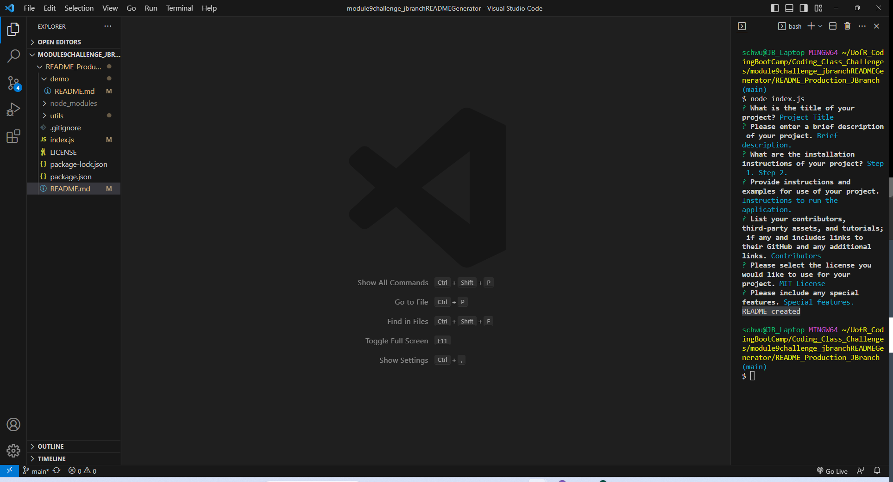
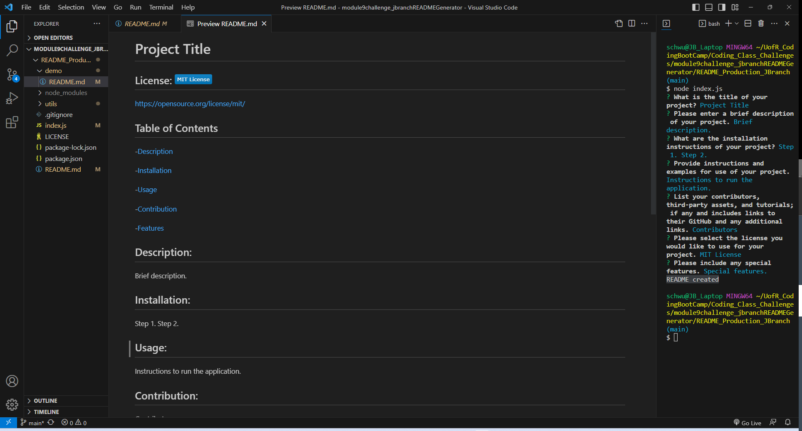

# Professional README Generator

  ## License: 

  
  
  ## Table of Contents

  -[Description](#description)

  -[Installation](#installation)

  -[Usage](#usage)

  -[Contribution](#contribution)

  -[Features](#features)

  ## Description:
  This application will help the user create a README.md file for their application by taking them through a series of questions. The answers will then be applied to create their own unique README file.

  ## Installation:
  Step 1: Install Inquirer by using the integrated terminal and entering npm install inquirer.

  Step 2: Next enter node index.js.

  Step 3: Application is now running.

  ## Usage:
  Once the installation process is complete the terminal will automatically take the user through a series of questions. Enter you answer and then press 'enter'. For the 'License' selection, use the up and down arrows to move to the license option of your choice. Press the space bar to select the preferred option. Press 'enter' to add license selection to README file. 

  https://jbranch6432.github.io/README_Production_JBranch/

  https://drive.google.com/file/d/1iGob3qsUHyWoXk4e14M1TSzi0FJmUbZ8/view

  
  

  ## Contribution:
  

  ## Features:
   